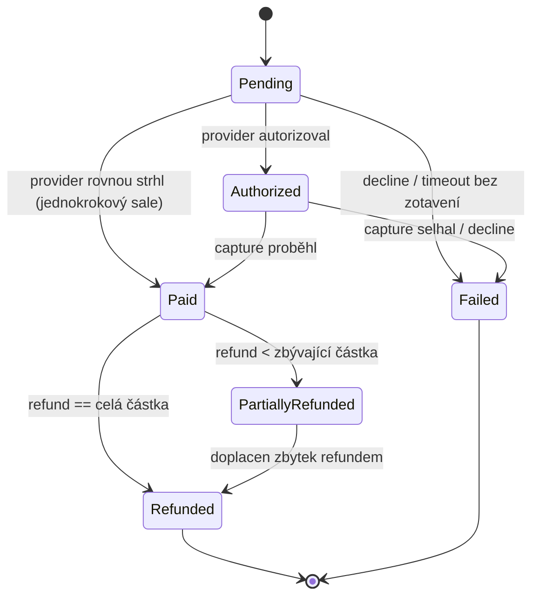

# Payment state machine

## Stavy

| Stav | Význam |
|---|---|
| `Pending` | Platba vytvořená, čeká se na výsledek od provideru. |
| `Authorized` | Provider peníze zarezervoval (autorizoval), ještě nestrhl. Volitelný mezikrok pro dvoufázový flow. |
| `Paid` | Peníze skutečně vybrané. |
| `PartiallyRefunded` | Vráceno `0 < sum(refunds) < amount`. |
| `Refunded` | Vráceno `sum(refunds) == amount`. |
| `Failed` | Platba se nepovedla (decline/timeout bez zotavení) - terminální. |

## Diagram

## Tabulka přechodů (co je a co NENÍ povolené)

| Z | Do | Povoleno | Poznámka |
|---|---|---|---|
| Pending | Authorized | ano | dvoufázový flow |
| Pending | Paid | ano | jednofázový flow (fake provider SUCCESS) |
| Pending | Failed | ano | DECLINED/TIMEOUT bez zotavení |
| Authorized | Paid | ano | capture |
| Authorized | Failed | ano | capture selhal |
| Paid | PartiallyRefunded | ano | `0 < sum(refunds) < amount` |
| Paid | Refunded | ano | refund rovnou pokryje celou částku |
| PartiallyRefunded | Refunded | ano | doplacení zbytku |
| PartiallyRefunded | PartiallyRefunded | n/a | není "přechod" - další partial refund nemění status, jen přidá `PaymentEvent`/`Refund` záznam |
| Refunded / Failed | cokoliv | **ne** | terminální stavy |
| PartiallyRefunded | Paid | **ne** | refund nejde vzít zpět |
| Authorized | Pending | **ne** | žádné přechody zpátky |

**Terminální stavy:** `Refunded`, `Failed` - `PaymentStatus::isTerminal()` vrací `true`, `allowedTransitions()` prázdné pole.

**Kdo rozhoduje o cíli u refundů:** Nejde o to, že by kód řekl "přejdi do PartiallyRefunded" natvrdo - `RefundService` (Den 2) spočítá `sum(refunds)` po vložení nového refundu a podle toho, jestli se rovná `amount`, zvolí `Refunded`, nebo `PartiallyRefunded`. Pokud vyjde stejný stav, jako už platba má, žádný přechod se neprovádí (jen se zapíše event) - `canTransitionTo()` se volá jen když se stav opravdu mění.

## Kde žije logika

- **`App\Enums\PaymentStatus`** (čistý enum, bez závislostí) - nese *pravidla*: `allowedTransitions()`, `canTransitionTo()`, `isTerminal()`. Snadno unit-testovatelné bez DB.
- **`App\Services\PaymentStateMachine`** - provádí *efekt* přechodu: ověří přes enum, že je přechod platný (jinak vyhodí `InvalidStateTransitionException`), uloží nový status. Zabalené v `DB::transaction()` už teď, i když dnes je to jeden UPDATE - jakmile přidáme `PaymentEvent` audit log (příští krok), přibude do stejné transakce a hranice transakce už bude existovat, nebudeme ji dodatečně dohledávat.

## Implementace

- `App\Enums\PaymentStatus` — pravidla (`allowedTransitions()`, `canTransitionTo()`, `isTerminal()`).
- `App\ValueObjects\Money` — `readonly` VO, validace záporné částky a formátu měny v konstruktoru,
  `add()`/`subtract()`/`equals()`/`greaterThan()`/`isZero()`, mismatch měny při `add`/`subtract` vyhazuje výjimku.
- `App\Exceptions\InvalidStateTransitionException` — `DomainException`, nese `$from`/`$to`.
- `App\Services\PaymentStateMachine::transitionTo()` — no-op při `$from === $to` (druhý partial refund
  nemění status), jinak ověří `canTransitionTo()` a uloží v `DB::transaction()`.
- `payments` tabulka: ULID PK, `UNIQUE(merchant_id, idempotency_key)`, `CHECK (amount >= 0)`
  (raw `DB::statement`, protože Laravel 10 ještě nemá fluent `$table->check()` — to přišlo až v L11).
- `Payment::$fillable` neobsahuje `status` (jen přes `PaymentStateMachine`), proto `PaymentFactory`
  potřebovala stejný `forceFill()` trik jako `MerchantFactory`.

**Testy:** 36 testů, 82 assertions, vše zelené.
- Unit: `PaymentStatusTest` (kompletní cross-product 30 hran, ne jen pár příkladů),
  `MoneyTest` (validace, immutabilita, currency mismatch).
- Feature: `PaymentStateMachineTest` (validní/nevalidní přechod, no-op na stejný status),
  `PaymentModelTest` (money() accessor, enum cast, guard na `status`, `UNIQUE` per-merchant
  idempotency, `CHECK` constraint ověřený přímým `DB::table()->insert()` mimo Eloquent).

`./vendor/bin/pint` spuštěn, drobné opravy stylu (spacing, pořadí importů).

## Poznámka ke struktuře projektu

Původně jsem navrhoval vnořenou strukturu `app/Domain/Payment/...`, ale `Merchant` model už vznikl plochý (`app/Models/Merchant.php`) přes `artisan make:model`. Pro konzistenci zůstáváme u ploché struktury (`app/Models`, `app/Enums`, `app/ValueObjects`, `app/Services`, `app/Exceptions`) - vnořené `Domain/` podadresáře by pro rozsah tohoto projektu byly abstrakce navíc bez reálného přínosu.
